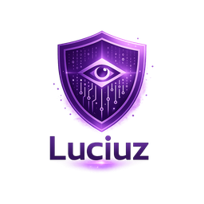

  

# Overview

Luciuz is a **secure-by-default** and **observability-by-default** web server / reverse proxy written in Rust.

It targets the same problem space as Nginx or Caddy, but with a strong focus on:

- **Safe defaults** (minimal attack surface, strict host handling, hardened service execution)
- **Operational clarity** (logs and signals you can trust in production)
- **A clean extensibility path** (Wasm roadmap)

## How it works (high level)
- **:443 (HTTPS)** is the real service.
- **:80 (HTTP)** is intentionally minimal:
  - In `http-01` mode: serves ACME challenges + redirects to HTTPS.
  - In `tls-alpn-01` mode: redirects to HTTPS (ACME runs on 443).

## Business model (Community / Pro)
Luciuz is developed as:
- **Community**: a public repository (open source) with the full core server.
- **Pro**: a private commercial crate for advanced modules/integrations.

## Next docs
- Quickstart: `quickstart.md`
- Configuration: `configuration.md`
- Security model: `security-model.md`
